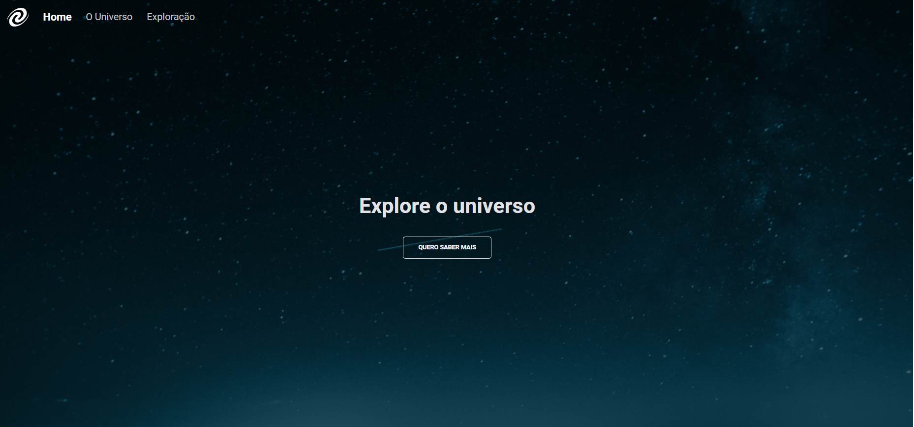

# Projeto SPA-Universe do curso Explorer da Rocketseat

    
    
    

SPA Universe é uma aplicação web de página única (Single Page Application - SPA) que oferece informações e exploração sobre o universo. O site possui diferentes seções, incluindo informações gerais sobre o universo e exploração espacial.

## :building_construction: Estrutura de Navegação

- **Home**: Página inicial que provavelmente oferece uma visão geral do site.
- **O Universo**: Seção que contém informações detalhadas sobre o universo.
- **Exploração**: Seção dedicada à exploração espacial.

## :exclamation: Pré-requisitos

Navegador web moderno

## :hammer: Instalação

1. Clone o repositório: git clone https://github.com/Raissa-Cardoso/XR-SPA-Universe.git
2. Abra o arquivo `index.html` em seu navegador web.

## :computer: Uso

Após abrir o arquivo `index.html` em seu navegador, você terá acesso ao SPA Universe. Você pode navegar entre as diferentes seções usando o menu de navegação.

## :star: Tecnologias utilizadas

- **`HTML`**
- **`CSS`**
- **`Javascript`**
